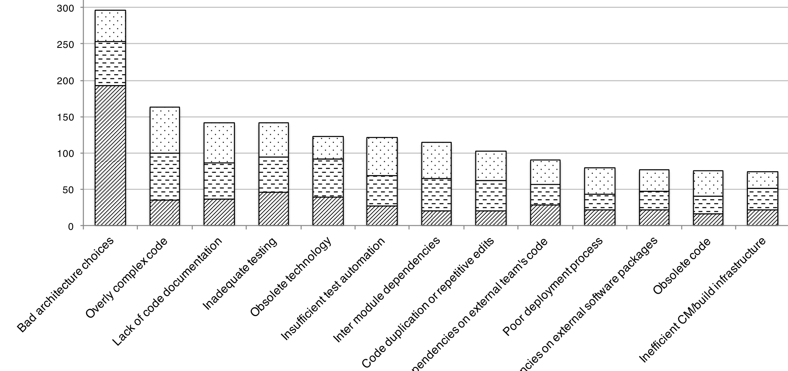
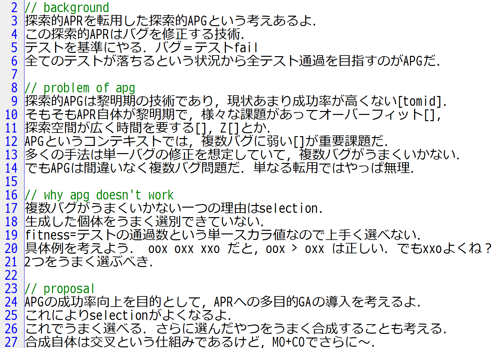

<!-- _class: title -->
# ソフトウェア設計論 <div class="logo">#15</div>
## まつ本

---
<!-- _class: outline-->
# 開発者が知っておくべきトピック集<br><sub>－実装編－</sub>
<div class="corner-triangle"><div class="corner-triangle-text">前回</div></div>

<span class="xisabled">・SWEBOK</span>

<span class="xisabled">・良い名前をつける</span>
<span class="xisabled">・コメントはない方が良い</span>

<span class="xisabled">・動くの先にある良いプログラム</span>
<span class="xisabled">・良いプログラムとは？</span>

<span class="xisabled">・_Don't call us, we'll call you_</span>
<span class="xisabled">・goto不要論からの学び</span>
<span class="xisabled">・できないことを増やす</span>

<span class="xisabled">・Complex vs Complicated</span>
<span class="xisabled">・分割統治</span>
<span class="xisabled">・DRY･KISS･YAGNI</span>

---
# SWEBOK 目次

## 全15章
```
1. SW要求
2. SW設計
3. SW構築          // 前回
4. SWテスティング   // 今日はここ ★★★★
5. SW保守
6. SW構成管理
7. SWエンジニアリング･マネージメント
8. SWエンジニアリングプロセス
9. SWエンジニアリングモデルおよび方法
10. SW品質
11. SWエンジニアリング専門技術者実践規律
12. SWエンジニアリング経済学
13. 計算基礎
14. 数学基礎
15. エンジニアリング基礎
```

---
# テストは面白い

## プログラミングと似た面白さ
パズル的な面白さ
自動化の気持ちよさ
導入が簡単で奥深い

## ものすごく役立つ
プログラミングを助ける･楽にする技術
実践的で応用の幅が広い
実装ほど難しくない点もプラス

## 理論的側面と実践的側面が共存
様々なセオリーが存在する
勉強するほどうまくなる

---
<!-- _class: outline-->
# 開発者が知っておくべきトピック集<br><sub>－テスト編－</sub>
<div class="corner-triangle"><div class="corner-triangle-text"></div></div>

<span class="xisabled">・SWテストの基本</span>

<span class="xisabled">・リファクタリングのためのテスト</span>
<span class="xisabled">・バグ修正のためのテスト</span>
<span class="xisabled">・回帰バグ対策としてのテスト</span>

<span class="xisabled">・演習</span>

<span class="xisabled">・テストを先に書く</span>
<span class="xisabled">・_"Clean code that works"_</span>

<span class="xisabled">・良いテスト</span>
<span class="xisabled">・テストは証明ではない</span>

<span class="xisabled">・テストのテクニック</span>


---
# ソフトウェアテスト

対象SWが意図通り動くかを検証するプロセス
下流工程の一つ, 実装とほぼ1:1

基本はSWを叩いてみて確認する <sub>(⇔ レビュー, 前回演習)</sub>

テストの一例：`sort(arr)` の単体テスト
```py
def test_sort1():
  actual = sort([2,3,1])    # プログラムを叩いてみて
  assert actual == [1,2,3]  # その結果を確認する

def test_sort2():
  actual = sort([1,2,3])
  assert actual == [1,2,3]

def test_sort3():
  actual = sort(None)       # Noneはどうなるか？
  assert actual == None
```

---
# 様々なテスト
## 誰が叩くのか？
人が叩く：マニュアルテスト
機械が叩く：自動テスト

## どういう目線で叩くか？
中身を意識する：ホワイトボックス
中身を意識しない：ブラックボックス

## SWの何をテストするか？
機能：単体テスト, 結合テスト, システムテスト
非機能：パフォーマンステスト, 負荷テスト, ..

## 今日は自動テストに着目
---
# テスト作成の流れ

インタフェースを決める
```py
def sort(arr: list[int]) -> list[int]
```

実装する
```py
def sort(arr: list[int]) -> list[int] {
  for ...
```

テストを作る
```py
def test_sort1():
  actual = sort([2,3,1]) 
  assert actual == [1,2,3] 
```

仕様とIFが決まればテストは作成できる
```
仕様 + IF ⇒ 実装
仕様 + IF ⇒ テスト
```

<!--
---
# 例：実験スクリプトの場合

インタフェースを決める
```java
python analyze.py in-file out-file
```

実装する
```python
def analyze(in_file, out_file):
  f = open(in_file);
  ..
```

テストを作る
```python
def test_analyze():
  analyze("test-in.txt", "tmp.txt");
  assert("tmp.txt").isSameAs("test-out.txt");
```
-->

---
# なぜ自動テストが必要なのか？

## よくあるテスト <sub>(半自動テスト)</sub>
```python
if __name__ == '__main__':
  print(sort([2,3,1]));
  print(sort([1,2,3]));
  print(sort([3,2,1,1,1,1,1,1,0]));
```

```
1,2,3
1,2,3
0,1,1,1,1,1,1,2,3
```

検証にコストを要する, ミスする可能性がある

テストに再利用性がない
　- その瞬間の正しさしか確認できていない
　- 変更時にまた目視で検証するのか？

自動化されていないこと自体が問題

---
# 無茶な自動テスト

```py
if __name__ == '__main__':
  # print(sort([2,3,1]));
  if sort([2,3,1]) == [1,2,3]: # 検証も自動化
    print("ok")
  else:
    print("ng")
```

## ここまでやるならテストFWを使おう
テストの<u>共通処理</u>をFWに任す
　- テストケースの回収･実行
　- 検証 `assert()`
　- 実行結果 `ok` `ng` の回収
　- テストのメタデータ付与 <sub>(名前等)</sub>

バグを減らす一つの方法はコードを書かないこと

---
# 各種言語のテストFW
## Java：*JUnit, TestNG

```java
@Test @DisplayName("非整列データのソート")
void testSort1() {
  List actual = sort([2,3,1]);
  assertThat(actual).equalTo([1,2,3]);
}
```

## Python：*pytest, unittest
```py
def test_sort1():
  assert sort([2,3,1]) == [1,2,3]
```

```
$ pytest -v
test_sort.py::test_sort1 PASSED                 [ 33%]
test_sort.py::test_sort2 PASSED                 [ 66%]
test_sort.py::test_sort3 PASSED                 [100%]
================= 3 passed in 0.02s ==================
```


---
# 手動テストにも価値がある

## 特にE2Eテスト <sub>(End to end)</sub>
システム全体のテスト
エンドユーザの実利用を想定したテスト

自動化しにくい, 自動テストに向かない

自動検証しにくい事項もある
　- UIのくずれ, 見た目
　- 操作感

## 向き不向き
自動テスト：システムの細かな部品
手動テスト：システム全体の振る舞い

---
<!-- _class: outline-->
# 開発者が知っておくべきトピック集<br><sub>－テスト編－</sub>
<div class="corner-triangle"><div class="corner-triangle-text"></div></div>

<span class="disabled">・SWテストの基本</span>

<span class="xisabled">・リファクタリングのためのテスト</span>
<span class="xisabled">・バグ修正のためのテスト</span>
<span class="xisabled">・回帰バグ対策としてのテスト</span>

<span class="disabled">・演習</span>

<span class="disabled">・テストを先に書く</span>
<span class="disabled">・_"Clean code that works"_</span>

<span class="disabled">・良いテスト</span>
<span class="disabled">・テストは証明ではない</span>

<span class="disabled">・テストのテクニック</span>


---
# リファクタリング
## プログラムの振る舞いを変えずに内部を改善
例）無駄処理の排除, 関数化, 変数名の修正, ...

プログラムができたらリファクタリングすべき
良くない状態を放置しない, 負債を貯めない


<subb>https://medium.com/@raychongtk/why-is-refactoring-important-2f1e4dec21ab</subb>

---
# 技術的負債
<div class="corner-triangle"><div class="corner-triangle-text">雑談</div></div>




---
# リファクタリングによる破壊
## プログラムの「振る舞いを変えずに」～
振る舞いを変えないのが難しい

すぐに壊れるならまだマシ
壊れていることに気づかないケースが最悪
　- 新たなバグの混入
　- 不要と判断した処理が実は必要だった


## Q. 振る舞いの維持をどう確認すれば良いか？
リファクタリング前後での等価性を判定したい

もし等価性を自動判定できたら？
　→ リファクタリングを恐れなくて良くなる

---
# <!--fit-->リファクタリングのためのテスト
## テストを等価性判定の目安に使う
1. リファクタリング前にテストを用意しておく
2. テストが通る状態を保ちつつ内部を改善する

もしテストが落ちたら？
　→ リファクタリング失敗

## リファクタリングでIFが変わる場合は？

```diff
- def sort(arr)
+ def sort(arr, is_ascending)
```

一時的なラッパーを作っておく
```py
def sort(arr):
  return sort(arr, True)
```
テストとソースを同時に直さない

---
# バグ修正のためのテスト
## 予期せぬバグが起きた場合：
1. バグが発生する条件･状況を探す

```java
sort([3,1,2,-5]);
   → [1,2,3,-5]  // bug!!
```


2. その条件･状況をテストに起こす
プログラムの正しい振る舞いを定義 & 自動検証

```py
def test_sort_negative():
  l = sort([3,1,2,-5])
  assert l == [-5,1,2,3]
```

3. テストがfailすることを確認する
4. テストがpassするようにバグを直す

テストとソースを同時に直さない


---
# バグ報告もテストと同時に
## バグ報告に書くべき項目
バグの概要
環境
バグの再現方法 ★
期待する振る舞い ★
実際の振る舞い ★

```py
def test_sort_negative():
  l = sort([3,1,2,-5])
  assert l == [-5,1,2,3]
```

## 下手な文章よりも役立つ
機械解読可能 ＝ 客観的
コード化 ＝ 自動化･再現可能

---
# 何でもソースコードにしよう
<div class="corner-triangle"><div class="corner-triangle-text">雑談</div></div>

## インストール手順のコード化
<sub>※Home brewのインストールスクリプト</sub>
```shell
$ /bin/bash -c "$(curl -fsSL https://raw.git../install.sh)"
```


## ビルド方法･依存解決のコード化
Java: Gradle, Bazel
Python: `requirements.txt` + `$ pip install`

## 仮想環境のコード化
Docker

## インフラ環境のコード化 (IaC)
Chef, Puppet, Pulumi

---
# 回帰バグ対策としてのテスト
## 回帰バグ
昔のバグが再度現れる現象

プログラム変更時に発生した予期せぬ別の問題
バグを直したら別のバグが出てくる

「レグレッションがおきた」
「デグレした」

## テストは回帰バグの特効薬
バグ修正時に必ず対応するテストを作る
プログラム変更時に常にテストを回す


---
<!-- _class: outline-->
# 開発者が知っておくべきトピック集<br><sub>－テスト編－</sub>
<div class="corner-triangle"><div class="corner-triangle-text"></div></div>

<span class="disabled">・SWテストの基本</span>

<span class="disabled">・リファクタリングのためのテスト</span>
<span class="disabled">・バグ修正のためのテスト</span>
<span class="disabled">・回帰バグ対策としてのテスト</span>

<span class="xisabled">・演習</span>

<span class="disabled">・テストを先に書く</span>
<span class="disabled">・_"Clean code that works"_</span>

<span class="disabled">・良いテスト</span>
<span class="disabled">・テストは証明ではない</span>

<span class="disabled">・テストのテクニック</span>

---
<!-- _class: enshu-->
# 演習 <sub>(10m)</sub>
## 以下のプログラムのテストケースを作成せよ
```py
def isSemVer(v: str) -> bool:
  """文字列vがsemverの書式に従っているかを確認する
  semver = majorVer.minorVer.patchVer
  """
```

テストケース例
```py
assert isSemVer('1.2.3')  == True
assert isSemVer('1.2.99') == True

assert isSemVer('1.2.')  == False
assert isSemVer('1.2.a') == False
```

## 提出方法
テストのテキストをCLEに提出すること
正解がある問題ではないので自由に考えること

---
<!-- _class: enshu-->
# そもそも正しいsemverとは？

```python
# Backus–Naur Form Grammar for Valid SemVer Versions
<valid semver> ::= <version core>
          | <version core> "-" <pre-release>
          | <version core> "+" <build>
          | <version core> "-" <pre-release> "+" <build>

<version core> ::= <major> "." <minor> "." <patch>

<major> ::= <numeric identifier>
<minor> ::= <numeric identifier>
<patch> ::= <numeric identifier>

<numeric identifier> ::= "0"
          | <positive digit>
          | <positive digit> <digits>
<positive digit> ::= "1" | "2" | "3" | .. | "9"
<digit> ::= "0" | <positive digit>
```
<subb>https://semver.org/</subb>

---
<!-- _class: enshu-->
## 解答例
valid
```
1.2.3
1.2.99
1.2.0
0.0.0
10.20.30
99999999999999999.99999999999999999.99999999999999999
```

invalid
```
1
1.2
1.2.
1.2.3.
1..3
aaa
1.01.1
1. 2.3
1.-2.3
```

---
<!-- _class: enshu-->
## もっと真面目なテストケース
valid
```
1.1.2-prerelease+meta
1.0.0-alpha
1.0.0-beta
1.0.0-alpha.beta
1.0.0-alpha.beta.1
1.0.0-alpha.1
1.0.0-alpha0.valid
1.0.0-alpha.0valid
1.0.0-alpha-a.b-c-somethinglong+build.1-aef.1-its-okay
1.0.0-rc.1+build.1
2.0.0-rc.1+build.123
1.2.3-beta
10.2.3-DEV-SNAPSHOT
1.2.3-SNAPSHOT-123
2.0.0+build.1848
2.0.1-alpha.1227
```
<subb>https://github.com/semver/semver/issues/833#issuecomment-1186845563</subb>

---
<!-- _class: enshu-->
# テスト ≒ 仕様
## 仕様が決まらないとテストは作れない
```
仕様 + IF ⇒ 実装
仕様 + IF ⇒ テスト
```

IF = `isSemVer(s: str) -> bool:`　仕様 = `BNF`

## テストは<u>自動検証可能な</u>仕様である
コード化された仕様

## テストがあると実装が楽 <sub>(テストがゴールになる)</sub>
```
実装前の状態: -----------------------    0%
まず軽く実装: oooooooo------oo-------   50%
少し修正する: oooooooooooooooooooo-oo   98%
完成！！！！: ooooooooooooooooooooooo  100%
```

<subb>https://kusumotolab.github.io/lecture-sw-design/src/test_semver.py</subb>


---
<!-- _class: outline-->
# 開発者が知っておくべきトピック集<br><sub>－テスト編－</sub>
<div class="corner-triangle"><div class="corner-triangle-text"></div></div>

<span class="disabled">・SWテストの基本</span>

<span class="disabled">・リファクタリングのためのテスト</span>
<span class="disabled">・バグ修正のためのテスト</span>
<span class="disabled">・回帰バグ対策としてのテスト</span>

<span class="disabled">・演習</span>

<span class="xisabled">・テストを先に書く</span>
<span class="xisabled">・_"Clean code that works"_</span>

<span class="disabled">・良いテスト</span>
<span class="disabled">・テストは証明ではない</span>

<span class="disabled">・テストのテクニック</span>


---
# テストを先に書く
## TDD <sub>- Test driven development, テスト駆動開発</sub>
1. まずはテストを書く
2. テストが通るようにプログラムを作る
3. テストを通るようになったらリファクタリング

テストを自動検証可能な仕様だとみなす

## 1の終了の時点
```py
def test_sort1():
  assert sort([2,3,1]) == [1,2,3]
def test_sort2():
  assert sort([1,2,3]) == [1,2,3]
def test_sort3(): ...
```

```py
def sort(arr):
  return None
```

---
# _"Clean code that works"_
## TDDの肝
「動くコード」と「良いコード」を分けて考える
分割統治の考え

step1. まずは動くコードを作る
step2. 動いたら良くする

```
                         ｜     ★
   Clean                 ｜    step2
                         ｜
          －－－－－－－－－－－－ ↑ －－－－－－
                         ｜     
   Dirty         ☆       →     ★
               step0     ｜    step1

           Doesn't work        Work
```


---
# 論文でも同じことが言える
<div class="corner-triangle"><div class="corner-triangle-text">雑談</div></div>



---
# Test Driven Class
<div class="corner-triangle"><div class="corner-triangle-text">雑談</div></div>

## テスト駆動の演習 (演習D)

学生に仕様とテストを配布する
　- 4つのサブ課題, 各課題にテスト20個程度

学生は仕様に従いテストが通るように実装する
全テストが通れば課題達成

## Pros
TDD･テストの経験を得られる
TDD･テストの恩恵を自然に受けられる
　- 機能の自動的な検証
　- リファクタリング支援

教員の手間が減る


---
<!-- _class: outline-->
# 開発者が知っておくべきトピック集<br><sub>－テスト編－</sub>
<div class="corner-triangle"><div class="corner-triangle-text"></div></div>

<span class="disabled">・SWテストの基本</span>

<span class="disabled">・リファクタリングのためのテスト</span>
<span class="disabled">・バグ修正のためのテスト</span>
<span class="disabled">・回帰バグ対策としてのテスト</span>

<span class="disabled">・演習</span>

<span class="disabled">・テストを先に書く</span>
<span class="disabled">・_"Clean code that works"_</span>

<span class="xisabled">・良いテスト</span>
<span class="xisabled">・テストは証明ではない</span>

<span class="disabled">・テストのテクニック</span>


---
# 良いテスト
## 良いテストとは？
バグの検出能力が高い (≒ 網羅率が高い)
読みやすい･保守しやすい

## 単純であればあるほどよい
分岐 `if` `for` を極力使わない
テスト自体のバグを避けるため
繰り返してもOK, DRYでなくても良い
関数化も最低限に

## 1テストケース＝1シナリオ
テスト対象の利用方法という側面もある
たくさんのことをしない

---
# 良いプログラムとは？
<div class="corner-triangle"><div class="corner-triangle-text">再掲</div></div>

## 信頼性･効率性 <sub>(実行的側面の良さ)</sub>
目的を満たすか？バグがないか？
計算リソースの無駄がないか？

## 可読性･保守性
読みやすいか？意図を汲み取れるか？

## 拡張性
拡張時の作業は書き換えか？追加か？

## <u>テスタビリティ</U>
`main()` vs `main()`+`sub1()`+`sub2()`+`sub3()`


---
# Complex vs Complicated
<div class="corner-triangle"><div class="corner-triangle-text">再掲</div></div>

<br>
<brr>

## 
<subb>https://www.gilkisongroup.com/investing-complicated-or-complex/</subb>


---
# 良いプログラムと良いテスト
## テストが楽なプログラムを作ろう
うまく分割統治すればするほどテストが楽
テストが楽なほど実装も楽

分割統治されていない何でもできるメソッド
```java
HugeObject doALotOfThings(param1, param2, param3, ...) {
```
分割統治された単一のことしかできないメソッド
```java
TinyObject doTinyThing(param1) {
```

## 良いプログラム ≒ テストしやすいプログラム
責務が明確である, 具体的で明確な名前を持つ
副作用がない,  状態を持たない, 決定的である

関数型言語はテストしやすい


---
<!-- _class: outline pd30-->

<br><br><br><br><br>
<brr>

_Program testing can be used to show the presence of bugs, but never to show their absence_

<sub>E.W. Dijkstra</sub>


---
# テストは証明ではない
## 全組み合わせのテストは不可能
`isSemVer(s)` のパラメタの組み合わせは無限

## テストは無料ではない
大きなシステムの全テストは1日かかる

## テストの経済学と心理学
経済的なテストを作る
　- 効率の良さのこと

開発者の心理を考えてテストを作る
　- 開発者がミスしやすそうな部分を考える
　- 開発経験があるほど良いテストを作れる

---
# プログラムの正しさの証明？
## 形式手法
<div class="corner-triangle"><div class="corner-triangle-text">雑談</div></div>

数学的･形式的な分析に基づいて信頼性を確認
システム全体を数学的に表現することで検証する


<subb>E.M. Clarke et al, ACM Computing Surveys 1996.</subb>

ミッションクリティカル分野で利用されている
航空システム･医療等

形式手法と比べるとテストは手軽で安価


---
<!-- _class: outline-->
# 開発者が知っておくべきトピック集<br><sub>－テスト編－</sub>
<div class="corner-triangle"><div class="corner-triangle-text"></div></div>

<span class="disabled">・SWテストの基本</span>

<span class="disabled">・リファクタリングのためのテスト</span>
<span class="disabled">・バグ修正のためのテスト</span>
<span class="disabled">・回帰バグ対策としてのテスト</span>

<span class="disabled">・演習</span>

<span class="disabled">・テストを先に書く</span>
<span class="disabled">・_"Clean code that works"_</span>

<span class="disabled">・良いテスト</span>
<span class="disabled">・テストは証明ではない</span>

<span class="xisabled">・テストのテクニック</span>

---
# パラメタ化テスト
テストをDRYにする手法

non-DRYなテスト
```py
def test_semver_valid1():
    assert isSemVer('1.2.3') == True
def test_semver_valid2():
    assert isSemVer('1.2.99') == True
def test_semver_valid3():
    assert isSemVer('1.2.0') == True
```

パラメタ化テスト
```py
@pytest.mark.parametrize('semver', [
    '1.2.3',
    '1.2.99',
    '1.2.0'])
def test_semver_valid(semver):
    assert isSemVer(semver) == True
```
<subb>https://kusumotolab.github.io/lecture-sw-design/src/test_semver_param.py</subb>

---
# モック
プログラムの依存先を置き換える手法
テストダブルの一種 <sub>(スタブ, スパイ, フェイク, ダミー)</sub>

## 題材：じゃんけんゲーム
<subb>https://kusumotolab.github.io/lecture-sw-design/src/game.py</subb>
<subb>https://kusumotolab.github.io/lecture-sw-design/src/test_game.py</subb>

ランダムな手を出すプレイヤ

```py
class RandomPlayer():
    def next_hand(self):
        r = random.random()
        if r > 0.66:
            return ROCK
        elif r > 0.33:
            return PAPER
        else:
            return SCISSORS
```

---
## 非決定的なプログラムをどうテストする？
```py
def test_random_player():
    player = RandomPlayer()
    hand = player.next_hand()
    assert # ?????????
```


## 非決定的な部分だけをモック (模倣) する
```py
def test_random_player(mocker):
    mocker.patch('random.random', return_value=0.7)
    player = RandomPlayer()
    hand = player.next_hand()
    assert hand == ROCK
```

## モック以外の乱数対策
シードを固定する (可読性に難あり)
統計的にテストする (コスト･安定性に難あり)
乱数に依存性を注入 (テストのためだけの実装)


---
## じゃんけんゲームのゲームエンジン
```py
class Game():
    def play(self, player1, player2):
        for _ in range(10):
            hand1 = player1.next_hand()
            hand2 = player2.next_hand()
            winlose = compare(hand1, hand2)
            if winlose != DRAW:
                return winlose
        return DRAW
```

## どうテストする？
```py
def test_game():
    player1 = RandomPlayer()
    player2 = RandomPlayer()
    game = Game()
    winlose = game.play(player1, player2)
    assert # ???????
```

---
## モックありテスト
```py
def test_game():
    player1 = RandomPlayer()
    player2 = RandomPlayer()
    player1.next_hand = MagicMock(return_value=ROCK)
    player2.next_hand = MagicMock(return_value=SCISSORS)
    game = Game()
    winlose = game.play(player1, player2)
    assert winlose == LEFT_WINS
```

## モックありテスト <sub>(引き分けの確認)</sub>
```py
def test_game_draw():
    player1 = RandomPlayer()
    player2 = RandomPlayer()
    player1.next_hand = MagicMock(return_value=ROCK)
    player2.next_hand = MagicMock(return_value=ROCK)
    game = Game()
    winlose = game.play(player1, player2)
    assert winlose == DRAW
```
---
# モックまとめ
## モックを使うべき状況
モック先の制御が難しい <sub>(非決定的)</sub>
モック先の処理コストが高い <sub>(高計算, DB依存, NW依存)</sub>
モック先が十分にテストされている

## やりすぎ注意
実装をねじ曲げる手法ではある
なんでもできる <sub>(goto文と同じ)</sub>

やりすぎると：
　- テストの可読性が下がる
　- テスト自体のバグにつながる
　- プロダクトのバグの見逃しにつながる

---
<!-- _class: outline-->
# 開発者が知っておくべきトピック集<br><sub>－テスト編－</sub>
<div class="corner-triangle"><div class="corner-triangle-text"></div></div>

<span class="xisabled">・SWテストの基本</span>

<span class="xisabled">・リファクタリングのためのテスト</span>
<span class="xisabled">・バグ修正のためのテスト</span>
<span class="xisabled">・回帰バグ対策としてのテスト</span>

<span class="xisabled">・演習</span>

<span class="xisabled">・テストを先に書く</span>
<span class="xisabled">・_"Clean code that works"_</span>

<span class="xisabled">・良いテスト</span>
<span class="xisabled">・テストは証明ではない</span>

<span class="xisabled">・テストのテクニック</span>

---
# テストは面白い
<div class="corner-triangle"><div class="corner-triangle-text">再掲</div></div>

## プログラミングと似た面白さ
パズル的な面白さ
自動化の気持ちよさ
導入が簡単で奥深い

## ものすごく役立つ
プログラミングを助ける･楽にする技術
実践的で応用の幅が広い
実装ほど難しくない点もプラス

## 理論的側面と実践的側面が共存
様々なセオリーが存在する
勉強するほどうまくなる

