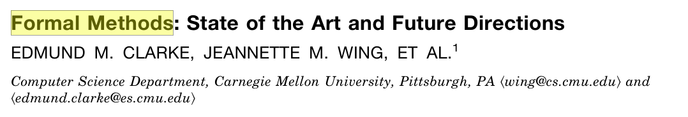

<!-- _class: title -->
# ソフトウェア設計論 <div class="logo">#15</div>
## まつ本

---
<!-- _class: outline-->
# 開発者が知っておくべきトピック集<br><sub>－実装編－</sub>
<div class="corner-triangle"><div class="corner-triangle-text">前回</div></div>

<span class="xisabled">・SWEBOK</span>
<span class="xisabled">・良い名前をつける</span>
<span class="xisabled">・コメントはない方が良い</span>
<span class="xisabled">・動くの先にある良いプログラム</span>
<span class="xisabled">・良いプログラムとは？</span>
<span class="xisabled">・_Don't call us, we'll call you_</span>
<span class="xisabled">・goto不要論からの学び</span>
<span class="xisabled">・できないことを増やす</span>
<span class="xisabled">・Complex vs Complicated</span>
<span class="xisabled">・分割統治</span>
<span class="xisabled">・DRY･KISS･YAGNI</span>

---
# SWEBOK 目次

## 全15章
```
1. SW要求
2. SW設計
3. SW構築          // 前回
4. SWテスティング   // 今日はここ ★★★★
5. SW保守
6. SW構成管理
7. SWエンジニアリング･マネージメント
8. SWエンジニアリングプロセス
9. SWエンジニアリングモデルおよび方法
10. SW品質
11. SWエンジニアリング専門技術者実践規律
12. SWエンジニアリング経済学
13. 計算基礎
14. 数学基礎
15. エンジニアリング基礎
```

---
# テストは面白い

## プログラミングと似た面白さ
パズル的な面白さ
自動化の気持ちよさ
実装ほど難しくはないがやはり奥深い

## ものすごく役立つ
プログラミングを助ける･楽にする技術
実践的で応用の幅が広い
実装ほど難しくない点もプラス

## 理論と実践の境界
様々なセオリーが存在する
勉強するほどうまくなる

---
<!-- _class: outline-->
# 開発者が知っておくべきトピック集<br><sub>－テスト編－</sub>
<div class="corner-triangle"><div class="corner-triangle-text"></div></div>

<span class="xisabled">・SWEBOK</span>
・SWテストの基本
・手動テストは危険

・リファクタリング前にテスト
・先にテストを書く
・_Clean code that works_
・バグを直す前にテストを落とす

・テストは証明ではない
・テストはユーザ第1号である


---
# SWテスト

対象SWが意図通り動くかを検証するプロセス
下流工程の一つ, 実装とほぼ1:1

基本はSWを叩いてみて確認する
<sub>（レビューは叩かずに確かめる方法）</sub>

テストの一例：`sort(arr)` の単体テスト
```java
@Test void testSort1() {
  actual = sort([1,2,3]);     // プログラムを叩いてみて
  assert(actual).is([1,2,3]); // その結果を確認する
}
@Test void testSort2() {
  actual = sort([2,3,1]);
  assert(actual).is([1,2,3]);
}
@Test void testSortNull() {
  actual = sort([]);          // 空配列はどうなるか？
  ...
```

---
# 様々なテスト
## 誰が叩くのか？
人が叩く：マニュアルテスト
機械が叩く：自動テスト

## どういう目線で叩くか？
中身を意識する：ホワイトボックス
中身を意識しない：ブラックボックス

## SWの何をテストするか？
機能：単体テスト, 結合テスト, システムテスト
非機能：パフォーマンステスト, 負荷テスト, ..


---
# テスト作成の流れ

インタフェースを決める
```java
List sort(List);
```

実装する
```java
List sort(List l) {
  for (..
```

テストを作る
```java
@Test void testSort1() {
  assert(sort([1,2,3])).is([1,2,3]);
}
```

要求とIFが決まればテストは作成できる
実装より先にテストを作っても良い

---
# 例：実験スクリプトの場合

インタフェースを決める
```java
python analyze.py in-file out-file
```

実装する
```python
def analyze(in_file, out_file):
  f = open(in_file);
  ..
```

テストを作る
```python
def test_analyze(self):
  analyze("test-in.txt", "tmp.txt");
  assert("tmp.txt").isSameAs("test-out.txt");
```

---
# 手動テストは危険

## よくある良くない手動テスト
```python
print(sort([1,2,3]));
print(sort([3,2,1]));
print(sort([3,2,1,1,1,1,1,1]));
```

```
1,2,3
1,2,3
1,1,1,1,1,1,2,3
```

検証にコストを要する, ミスする可能性がある
テストに再利用性がない
　- その瞬間の正しさしか確認できていない
　- 変更時にまた手動でテストするのか？

自動化されていないこと自体が問題

---
# 無茶な自動テスト

```py
if sort([1,2,3]) == [1,2,3]:
  print("ok")
else
  print("ng")
if sort([3,1,2]) == [1,2,3]:
  print("ok")
else
  print("ng")
```

ここまでやるならテストFWを使おう
テストの<u>共通処理</u>をFWに任す
　- テストケースの回収
　- 検証 `assert()`
　- `ok` `ng`の回収
　- テストのメタデータ付与 (名前等)

バグを減らす一つの方法はコードを書かないこと

---
# 各種言語のテストFW
## Java：JUnit, TestNG

```java
@Test @DisplayName("ソート済みデータのソート")
void testSort1() {
  List l = sort([1,2,3]);
  assertThat(l).equalTo([1,2,3]);
}
```

## Python：pytest, unittest
```py
def test_sort1():
  assert sort([1,2,3]) == [1,2,3]
```

```
$ pytest -v
test_sort.py::test_sort1 PASSED                 [ 33%]
test_sort.py::test_sort2 PASSED                 [ 66%]
test_sort.py::test_sort3 PASSED                 [100%]
================= 3 passed in 0.02s ==================
```


---
<!-- _class: outline-->
# 開発者が知っておくべきトピック集<br><sub>－テスト編－</sub>
<div class="corner-triangle"><div class="corner-triangle-text"></div></div>

DUMMY

---
# リファクタリング
## 振る舞いを変えずにプログラム内部を改善する
無駄処理の排除, 関数の切り出し, 変数名の修正, ..

プログラムができたらリファクタリングすべき
良くない状態を放置しない, 負債を貯めない


<subb>https://medium.com/@raychongtk/why-is-refactoring-important-2f1e4dec21ab</subb>

---
# 技術的負債
<div class="corner-triangle"><div class="corner-triangle-text">雑談</div></div>


---
# リファクタリングによる破壊
## 「振る舞いを変えずに」プログラムを改善～
振る舞いを変えないのが難しい

すぐに壊れるならまだマシ
新たなバグの混入に気づかないことも


## Q. 振る舞いの維持をどう確認すれば良いか？
リファクタリング前と後の等価性を判定したい

---
# リファクタリング前にのテスト
## テストを等価性判定の目安に使う
リファクタリング前に必ずテストを用意しておく
テストが通るように内部を改善する

リファクタリングによってテストが落ちた
　→ リファクタリング失敗

## リファクタリングでIFが変わる場合は？
ラッパーを作っておく

```diff
- def sort(arr)
+ def sort(arr, is_ascending)
```

```py
def sort(arr):
  return sort(arr, True)
```
テストとソースを同時に直さない

---
# テストを先に書く
## TDD <sub>- Test driven development, テスト駆動開発</sub>
1. まずはテストを書く
2. テストが通るようにプログラムを作る
3. テストを通るようになったらリファクタリング

テストを自動検証可能な仕様だとみなす

## ステップ1終了の時点
```py
def test_sort1():
  assert sort([1,2,3]) == [1,2,3]
def test_sort2():
  assert sort([3,2,1]) == [1,2,3]
def test_sort3(): ...
```

```py
def sort(arr):
  return None
```

---
# _Clean code that works_
## TDDのキモ
動くコードと良いコードを分けて考える
分割統治の考え

まずは動くコードを作る
動いたら良くする

```
                         ｜
                         ｜     ★
   Clean                 ｜    step2
                         ｜
          －－－－－－－－－－－－－－－－－－－
                         ｜      ↑
   Dirty         ☆   →  ｜      ★
               step0     ｜    step1
                         ｜
           Doesn't work        work
```


---
# 論文でも同じことが言える
<div class="corner-triangle"><div class="corner-triangle-text">雑談</div></div>


---
# Test Driven Class
<div class="corner-triangle"><div class="corner-triangle-text">雑談</div></div>

## テスト駆動の演習 (演習D)

学生に仕様とテストを配布する
　- 4つのサブ課題, 各課題にテスト20個程度

学生は仕様に従いテストが通るように実装する

全テストが通れば課題達成

## Pros
TDD･テストの経験を得られる
TDD･テストの恩恵を自然に受けられる

教員の手間が減る

---
# バグを直す前にテストを落とす
## 予期せぬバグが起きた場合：
1. バグが発生する条件･状況を探す

```java
sort([3,1,2,-5]);
→ [1,2,3,-5]
```


2. その条件･状況をテストに起こす
プログラムの正しい振る舞いを定義 & 自動検証
```java
@Test public void testNegative() {
  List l = sort([3,1,2,-5]);
  assertThat(l).equalTo([-5,1,2,3]);
}
```

3. そのテストが通るようにバグを直す

常にテストとソースを同時に直さない


---
# バグ報告もテストと同時に
## バグ報告に書くべき項目
バグの概要
環境
バグの再現方法 ★
期待する振る舞い ★
実際の振る舞い ★

```java
@Test public void testNegative() {
  List l = sort([3,1,2,-5]);
  assertThat(l).equalTo([-5,1,2,3]);
}
```

## 下手な文章よりも役立つ
機械解読可能＝客観的･再現可能


---
# 何でもソースコードにしよう
<div class="corner-triangle"><div class="corner-triangle-text">雑談</div></div>

## インストール手順のコード化
※Home brewのインストールスクリプト
```
$ /bin/bash -c "$(curl -fsSL https://raw.git../install.sh)"
```

## ビルド方法･依存解決のコード化
Gradle, Bazel
`requirements.txt` + `pip install`

## 仮想環境のコード化
Docker

## インフラ環境のコード化 (IaC)
Chef, Puppet, Pulumi


---
<!-- _class: outline-->
# 開発者が知っておくべきトピック集<br><sub>－テスト編－</sub>
<div class="corner-triangle"><div class="corner-triangle-text"></div></div>

DUMMY

---
<br><br><br><br>

> Program testing can be used to show the presence of bugs, but never to show their absence

> テストはバグが存在することを示せるが，
バグがないことは示せない

<sub>Edsger W. Dijkstra</sub>

---
# テストは証明ではない
経済


---
# <!--fit-->プログラムの正しさの証明？
## 形式手法
<div class="corner-triangle"><div class="corner-triangle-text">雑談</div></div>

数学的･形式的な分析に基づいて信頼性を確認
システム全体を数学的に表現することで検証する


<sub>E.M. Clarke et al, ACM Computing Surveys 1996.</sub>

ミッションクリティカル分野で利用されている
航空システム･医療等

形式手法と比べるとテストは手軽で安価


---
# サボるために頑張る
投資


---
# テストの経済学と心理学


---
# 手でやらない

## 手でやるべき状況もある

---
# リファクタリング
